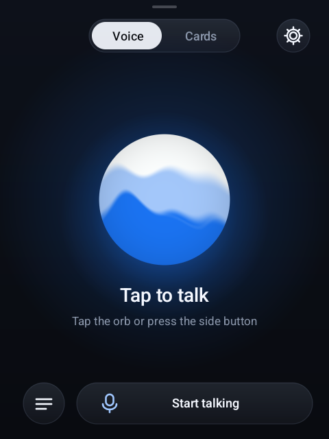
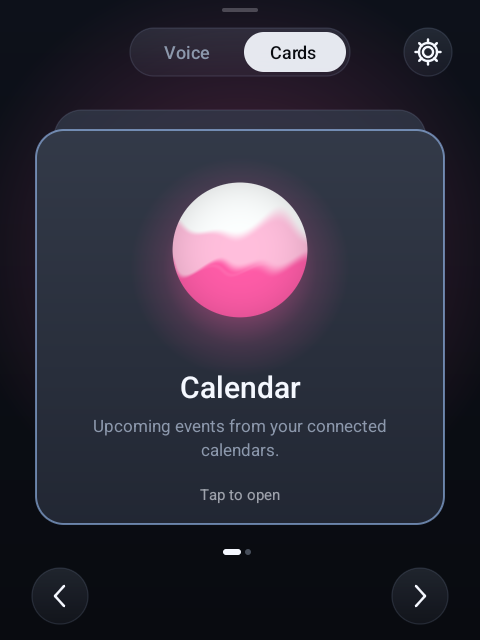
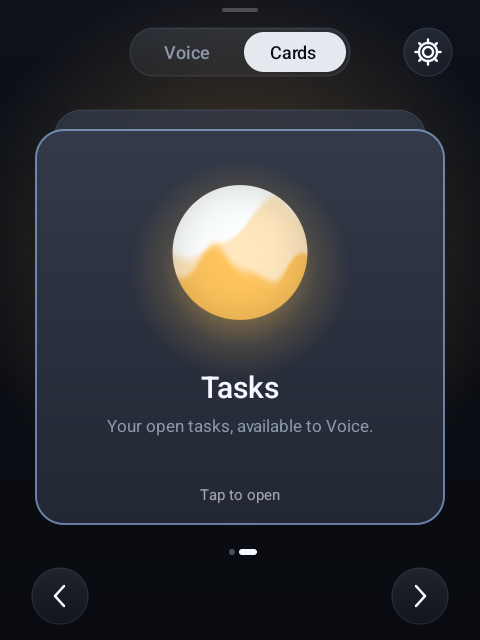
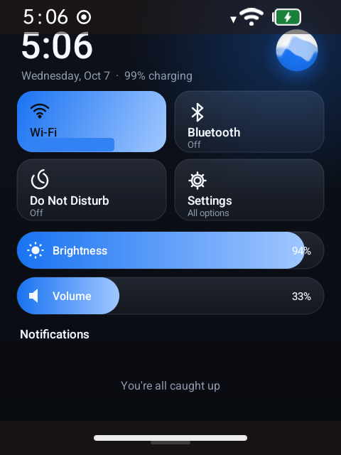
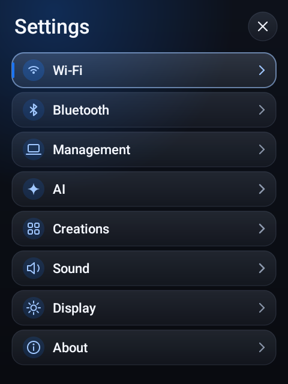

# SAM Project

**A voice-first AI assistant for the Rabbit R1, with a floating orb UI.**

> Hey, dude, this works on your GPT subscriptions. It's meant to use T3 Code and Hermes Agent, et cetera, as an orchestrator.

<p align="center">
  
  &nbsp;
  
  &nbsp;
  
</p>
<p align="center">
  
  &nbsp;
  
</p>

<p align="center"><em>Voice, Cards, Control Center, and Settings on the R1's 480×640 screen.</em></p>

## What it is

SAM Project replaces the R1's home screen with its own app:

- **Voice:** tap the orb or press the side button and talk. It works like ChatGPT Voice: live replies, a transcript, and mute, cancel, and end buttons.
- **Cards:** swipe for Calendar, Tasks, and any Creations you install. Each card has its own colored orb.
- **Control Center:** swipe down from the top for Wi-Fi, Bluetooth, Do Not Disturb, brightness, volume, and notifications.
- **Your AI account:** sign in with your ChatGPT subscription, or use an OpenAI API key.
- **Background Agent:** hand off a longer task by voice. It works on the device and reports back when it's done.
- **Extensions:** add Skills, Plugins, MCP servers, Mail, and Calendar from a web console on your local network.

Everything runs on the R1. Only the AI and the services you connect go over the internet.

## Get started

### 1. Put your rabbit in developer mode

1. Open [Rabbithole](https://hole.rabbit.tech) in a browser and pick your R1.
2. Go to **Settings → Developer → Device modification**.
3. Turn on **r1 bootloader unlock**.
4. Back up anything you need. Flashing erases the R1.

### 2. Flash it

1. Download the full image bundle (`jackrabbit-current-v0.2.zip`) from the [image folder](https://drive.google.com/drive/folders/1iteItXoQ3cVqyN4DhChQ3EOBlv68f8wM?usp=drive_link) and unzip it. The current bundle was built before the rename, so some file names and prompts inside it still use the old name. That's fine. Type the confirmation phrase exactly as the installer shows it.
2. Open the folder for your computer and run the installer:

   | Computer | Folder | Run |
   |---|---|---|
   | Mac (Apple Silicon or Intel) | `hosts/macos-arm64` or `hosts/macos-x64` | double-click `install.command` |
   | Windows | `hosts/windows-x64` | double-click `install.cmd` |
   | Linux | `hosts/linux-x64` | `./install.sh` |

3. Plug in the R1 and follow the prompts. Wait for `Image transfer complete.` and let the R1 boot. The screen can stay blank for a while on first boot.

The full walkthrough is in [installer/INSTALL.md](installer/INSTALL.md). If something goes wrong, see [installer/TROUBLESHOOTING.md](installer/TROUBLESHOOTING.md).

### 3. Put the stuff in

1. **Install the SAM UI.** Build the APK (see [BUILDING.md](BUILDING.md)), then install it with USB connected:
   ```bash
   ./android/scripts/build_apk_docker.sh
   adb install -r android/app/build/outputs/apk/debug/app-debug.apk
   ```
2. **Connect Wi-Fi:** on the R1, open **Settings → Wi-Fi**.
3. **Open the web console:** go to **Settings → Management** on the R1. Open the address it shows in a browser on the same Wi-Fi, then enter the pairing code.
4. **Set your name:** in the console, go to **Overview → Your Profile**, enter your name, and click **Save name**. Voice uses it to greet you.
5. **Connect your AI:** in **AI & Voice**, sign in with ChatGPT (subscription) or paste an OpenAI API key. Then pick your models.
6. **Add your stuff (optional):** connect Mail and Calendar under **Connections**. Add Skills, Plugins, MCP servers, and Creations under **Library**.
7. **Talk:** go back to the R1, tap the orb, and start talking.

## Using an orchestrator

SAM Project is meant to be driven by a coding agent such as **T3 Code** or **Hermes Agent**. Open this repo in the agent and plug the R1 in over USB (ADB). The agent can then build and install new UI, take screenshots, and add Skills and MCP connections for you. [llm.md](llm.md) gives the agent the context it needs to work on the project safely.

## More docs

- [USER-GUIDE.md](USER-GUIDE.md): device controls, Cards, connections, and troubleshooting
- [BUILDING.md](BUILDING.md): building the APK
- [EXTENSION-DEVELOPMENT.md](EXTENSION-DEVELOPMENT.md): building Skills, Plugins, MCP servers, and Creations
- [CONTRIBUTING.md](CONTRIBUTING.md): how to contribute
- [llm.md](llm.md): architecture notes for coding agents

## Repository map

- `android/`: the R1 home app (orb UI, Voice, Cards, Settings, Control Center)
- `runtime/`: the on-device Python runtime (agents, tools, storage, Mail, Calendar, Tasks)
- `web/`: the local-network management console
- `installer/`: the guided flasher for macOS, Windows, and Linux

## License

Noncommercial use only, under the [PolyForm Noncommercial License 1.0.0](LICENSE). See [LICENSE](LICENSE) for the full terms and required notices. SAM Project is not affiliated with, endorsed by, or sponsored by rabbit inc.
